# Experiment 1: Using User Pools to Control Agent Access

> Configure enterprise-grade access control for your intelligent agents in 10 minutes.

## Why is Inbound Authentication Necessary?

### First, a question

You've written an agent that runs well locally. Now it's time to go live for users.

At this point, you'll encounter a fundamental question: **Who can call your agent?**

### What happens without authentication?

- **Scenario 1: The Naked Agent**

```mermaid
flowchart LR
    A[🌐 Internet] -->|Anyone can call| B[🤖 Your Agent]
    B --> C[💰 Model API<br/>Billed by token]
    style A fill:#ffcccc
    style C fill:#ffffcc
```



Consequences:

- Someone writes a script to call it frantically, and your API fees explode overnight.
- Competitors reverse-engineer your agent.
- If a security incident occurs, you don't know who did it.

- **Scenario 2: The Agent Doesn't Know "Who You Are"**

Many agents need to provide personalized services based on user identity:

- Check "my orders" - which "me"?
- Access "my documents" - which "me"?
- Perform sensitive operations - do you have permission?

Without identity information, the agent either refuses service or can only provide the most basic public functions.

- **Scenario 3: Audit and Compliance**

The security team and CISO will ask you:

- Who is using this agent?
- How many times has it been used?
- Are there any abnormal calls?

If you can't answer, the compliance audit will fail directly. Financial, medical, and government and enterprise customers will not use it at all.

### The Core Issue: Inbound Identity

The link becomes clear when you draw it out:

```mermaid
flowchart LR
    A[👤 User] --> B[📱 Application]
    B -->|❓ Who are you?<br/>❓ Do you have permission?| C[🤖 Agent]
    C --> D[📦 Resource]
```



This is what **Inbound Authentication** is meant to solve:

1. **Authentication**: Prove "you are you."
2. **Authorization**: Confirm "you can use it."
3. **Propagation**: Pass the identity information to the agent.

### How Does Agent Identity Solve This?

We provide an out-of-the-box **User Pool** solution:

| Capability | Description |
| --- | --- |
| **Unified User Directory** | Manage all users who can access the agent in one place. |
| **Standard Protocols** | OAuth2/OIDC, no need to reinvent the wheel. |
| **JWT Token** | Stateless authentication, high performance, identity information can be passed to the agent. |
| **Enterprise-Grade Security** | Supports MFA, password policies, and login audits. |

After configuration, the call chain becomes:

```mermaid
flowchart TB
    A[👤 User] --> B[🔐 Log in to user pool]
    B --> C[🎫 Get Token]
    C --> D[📤 Call with Token]
    D --> E[🤖 Agent]
    E --> F[✅ Verify Token]
    E --> G[👁️ Know who is calling]
    E --> H[📝 Audit log]

    style B fill:#e6f3ff
    style C fill:#e6ffe6
```



**10 minutes of configuration to solve three problems: who can use it, who is using it, and what is being used.**

---

## Quick Start

### Prerequisites

| Item | Description |
| --- | --- |
| **Volcano Engine Console Account** | A sub-account with AgentKit Administrator permission is required. |
| **Python Environment** | Python 3.12+ and [uv](https://docs.astral.sh/uv/) |
| **AgentKit CLI** | Refer to [AgentKit CLI Security Guide](https://volcengine.github.io/agentkit-sdk-python/content/1.introduction/2.installation.html) |

### Step 1: Create a User Pool and Users (Console Operation)

1. **Access the Agent Identity Console**

2. **Open the [User Pool Management Page](https://console.volcengine.com/identity/region:identity+cn-beijing/user-pools)**

    

3. **Create a New User Pool**

    - Click "New User Pool"
    - Fill in the user pool name (e.g., `my_agent_users`)
    - Select login attributes: Username + Phone Number
    - Click "Confirm"
    

4. **Create a New Client**

    - Go to the user pool details → Click "New Client"
    - Client name: `agent_web_client`
    - Client type: Web Application
    - Callback URL: `http://127.0.0.1:8082/callback`
    - **Record the Client ID and Client Secret**
    

5. **Create a Test User**

    - In the user pool, select "User Management" → "New User"
    - Set a username and temporary password
    

### Step 2: Test Identity Pool Login

#### Configure Environment Variables

1. **Copy the environment variable template:**

    ```bash
    # Make sure you are in the correct directory
    cd tutorial-1-userpool-inbound

    # Create .env from the template
    cp .env.template .env
    ```

2. **Edit the `.env` file:**

    > In this step, `AGENT_NAME` and `AGENT_ENDPOINT` do not need to be modified.

    Find the correct `OAUTH2_ISSUER_URI`, `OAUTH2_CLIENT_ID`, and `OAUTH2_CLIENT_SECRET` from the console and fill them into the configuration file.

    ```bash
    # OAuth2 Configuration (copy from console)
    OAUTH2_ISSUER_URI=https://userpool-<USERPOOL_ID>.userpool.auth.id.<REGION>.volces.com
    OAUTH2_CLIENT_ID=<OAuth2 Client ID>
    OAUTH2_CLIENT_SECRET=<OAuth2 Client Secret>
    OAUTH2_REDIRECT_URI=http://127.0.0.1:8082/callback
    OAUTH2_SCOPES='openid profile email'
    ```

#### Install Dependencies

```bash
uv venv --python=3.12
uv pip install -r requirements.txt
```

#### Test OAuth Login

1. Start the test web application:

    ```bash
    python oauth2_testapp.py
    ```

2. Open your browser and visit [http://127.0.0.1:8082](http://127.0.0.1:8082/), then click "Sign in".

    

3. The browser will redirect to the user pool's login page. Log in with the username/password of the user you created in the console.

    

4. After successful login, you will be redirected to the authorization page. Click "Allow Access".

    

5. The browser will redirect to a page showing the obtained Access Token and the fields parsed from the token, where:

    - `aud` and `client_id` are the OAuth2 client ID used by this client (`OAUTH2_CLIENT_ID` variable).
    - `iss` is the issuer service address of the user pool used by this client (`OAUTH2_ISSUER_URI` variable).
    - `sub` is the `user_id` of the logged-in user.

    

### Step 3: Verify Identity Information

The previous process described how to obtain an Access Token issued by the identity pool through the OAuth2 login process. This section will introduce how AgentKit consumes the Access Token to verify identity information.

#### Understand the Identity Verification Process


#### Enable Identity Pool Verification

When creating an AgentKit Runtime, you can specify the use of **OAuth JWT** mode for inbound identity authentication. At this time, you need to specify the bound identity pool and (optionally) specify the allowed clients.

- If you are creating through the [AgentKit Runtime Console](https://console.volcengine.com/agentkit/region:agentkit+cn-beijing/runtime/create), the configuration method is as shown in the figure below:


- If you are creating a Runtime through the AgentKit CLI, you need to make the following configurations in `agentkit.yml`:
  - Set `runtime_auth_type` to `custom_jwt`.
  - Set `runtime_jwt_discovery_url` to the user pool's "OIDC Discovery Endpoint Discovery URL".
  - (Optional) Set `runtime_jwt_allowed_clients` to one or more allowed client IDs.

In the next section, we will use the AgentKit CLI to actually deploy an intelligent agent to the AgentKit runtime and enable identity verification.

#### Deploy a Target Agent

1. Create agentkit deployment configuration

    ```bash
    # Enter the test_agent directory, where a target agent is ready
    cd tutorial-1-userpool-inbound/test_agent

    # Create an agentkit.yaml configuration file from the template
    cp agentkit.yaml.template agentkit.yaml
    ```

2. Modify the `agentkit.yaml` configuration file to configure the correct `runtime_jwt_discovery_url` and (optional) `runtime_jwt_allowed_clients`.

    ```yaml
    common:
      agent_name: identity_demo_inbound
      entry_point: agent.py
      description: This is a simple intelligent agent that can help you query the weather.
      language: Python
      language_version: '3.12'
      agent_type: Basic App
      dependencies_file: requirements.txt
      runtime_envs: {}
      launch_type: cloud
    launch_types:
      cloud:
        region: cn-beijing
        # Required, specify the use of OAuth2 JWT for identity verification
        runtime_auth_type: custom_jwt
        # Required, specify the bound user pool
        # USERPOOL_DISCOVERY_URL can be found on the user pool page ("OIDC Discovery Endpoint Discovery URL")
        # The format is usually: https://userpool-<USERPOOL_ID>.userpool.auth.id.cn-beijing.volces.com/.well-known/openid-configuration
        runtime_jwt_discovery_url: <USERPOOL_DISCOVERY_URL>
        # Optional, specify allowed clients
        runtime_jwt_allowed_clients:
        - <CLIENT_ID_1>
        - <CLIENT_ID_2>
    ```

3. Run the deployment command

    ```bash
    # Configure Volcano Engine AK/SK in environment variables, ensuring AK/SK has permission to publish runtimes
    export VOLCENGINE_ACCESS_KEY=<Volcano Engine AK>
    export VOLCENGINE_SECRET_KEY=<Volcano Engine SK>

    # Make sure you are in the tutorial-1-userpool-inbound/test_agent directory
    agentkit launch
    ```

    If the deployment is successful, you will see a "Launch Successfully" prompt:

    

    Record the **Service endpoint address** (usually in the format `https://xxxx.apigateway-<region>.volceapi.com`), which we will use in the next section for testing.

4. After the deployment is complete, you can also see the deployed agent in the Runtime control interface.

    

    Click the name to enter the Runtime details page, where you can view the bound identity pool and confirm that it is consistent with the expected identity pool.

    

#### Test Agent Identity Verification

Using the OAuth2 access token obtained in step 2, you can perform a quick identity verification test.

```bash
# Set the runtime entry address
# The format of this address is usually: https://xxxx.apigateway-<region>.volceapi.com
export AGENT_ENDPOINT='<ENDPOINT of the agent you deployed>'

# Set the Access Token
# You can use the Access Token obtained in the previous identity pool login test
export ACCESS_TOKEN='<Access Token obtained after OAuth2 login>'

curl $AGENT_ENDPOINT'/invoke' \
  -H 'authorization: Bearer '$ACCESS_TOKEN \
  -H 'content-type: application/json' \
  --data-raw $'{"prompt": "What can you do?"}'
```

### Step 4: Complete Client Experience

#### Configure Environment Variables

1. Copy and fill in the environment variable template:

    ```bash
    # Make sure you are in the tutorial-1-inbound-userpool directory
    cp .env.template .env
    ```

2. Edit the `.env` file

    - Configure the `AGENT_ENDPOINT` variable to the port of the service just published to the AgentKit Runtime.
    - Configure the OAuth2 items (similar to step 2).

    ```bash
    # OAuth2 Configuration
    OAUTH2_ISSUER_URI=https://userpool-<USERPOOL_ID>.userpool.auth.id.<REGION>.volces.com
    OAUTH2_CLIENT_ID=<OAuth2 Client ID>
    OAUTH2_CLIENT_SECRET=<OAuth2 Client Secret>
    OAUTH2_REDIRECT_URI=http://127.0.0.1:8082/callback
    OAUTH2_SCOPES='openid profile email'

    # Target Agent Configuration
    AGENT_NAME='Default Agent'
    AGENT_ENDPOINT=<AgentKit Runtime Endpoint>
    ```

#### Install Dependencies

```bash
uv venv --python=3.12
uv pip install -r requirements.txt
```

#### Run the Client

1. Start the application

    ```bash
    uv run app.py
    ```

2. Open `http://127.0.0.1:8082` in your browser. Entering a request directly will return a 401 Unauthorized error.

    

3. Click "Login" to complete the login process (similar to step 2), and then enter the request again to get a correct response.

    

---

## Core Capability Review

> "With Agent Identity, you can configure enterprise-grade access control for your intelligent agents in **10 minutes**,
> ensuring that only authorized users can use the agent service.
>
> - **Security and Compliance**: Meet the identity authentication requirements of industries such as finance and healthcare.
> - **Unified Management**: Centralized user management, supporting MFA secondary verification.
> - **Seamless Integration**: Standard OAuth2 protocol, easy to integrate with existing systems.
> - **Audit and Traceability**: Every access is recorded to meet audit requirements."

---

**Key Points:**

- All requests will verify the JWT Token.
- Unauthorized requests will return a 401 error.

---

## Advanced: Integration with Feishu/Enterprise IdP

Want users to log in with their Feishu accounts? Please refer to:

→ [Experiment 2: Feishu IdP Federated Login](../tutorial-2-feishu-idp/README.md)

---

## Common Problems

| Problem | Solution |
| --- | --- |
| Login page keeps redirecting | Clear browser cache, check callback URL configuration. |
| Token expired | Default is 10 hours, can be configured with a refresh mechanism. |
| Forgot Client Secret | Regenerate it in the console. |

---

## Related Resources

- [Agent Identity Product Documentation](https://www.volcengine.com/docs/identity)

## Overview

## Core Functions

## Agent Capabilities

## Directory Structure Description

## Local Running

## AgentKit Deployment

## Sample Prompts

## Effect Display

## Common Problems

## Code License

This project follows the Apache 2.0 License.
