# Experiment 2: Feishu IdP Federated Login

> Use your Feishu account as your corporate identity source to enable single sign-on (SSO) for your intelligent agents.

## Business Scenario

Your company is already using Feishu as a unified communication and office platform, and all employees have Feishu accounts. Now you want to deploy an AI agent. How can you let employees log in directly with their Feishu accounts instead of creating a new set of accounts?

**Problems with traditional solutions:**

- Each system maintains an independent user base → users need to remember multiple sets of passwords
- User departure/onboarding requires synchronization across multiple systems → high management costs and risk of omission
- Unable to leverage Feishu's MFA/security policies → difficult to unify security and compliance

**Agent Identity solution:**

- Feishu as the identity provider (IdP), user pool as the service provider (SP)
- One-click login, no additional registration required
- Inherit Feishu's security policies and audit capabilities

## Differences from Experiment 1

| Comparison Item | Experiment 1 (User Pool Login) | Experiment 2 (Feishu Federated Login) |
| --- | --- | --- |
| Account Source | Created locally in the user pool | Feishu address book |
| Login Method | Username/Password | Feishu authorization |
| Applicable Scene | Independent user management | Unified corporate identity |
| User Experience | Requires registration | One-click login |

## Core Process

```mermaid
sequenceDiagram
    autonumber
    participant U as 👤 User Browser
    participant A as 🤖 Agent Application
    participant P as 🔐 User Pool
    participant F as 📱 Feishu IdP

    U->>A: Access application
    A-->>U: Redirect to login page

    U->>F: Click "Login with Feishu"

    rect rgba(0, 123, 255, 0.1)
        Note over U,F: OAuth 2.0 Authorization Flow
        F-->>U: Display Feishu authorization page
        U->>F: User confirms authorization
        F->>P: Return authorization code
        P->>F: Exchange authorization code for user information
        F-->>P: Return user information
    end

    P->>A: Create session / issue Token
    A-->>U: Login successful ✅
```



## Quick Start

### Prerequisites

- Complete the user pool creation and client configuration in Experiment 1
- Have a Feishu Open Platform account [Feishu Open Platform](https://open.feishu.cn/)

---

### Step 1: Create a Feishu Application

#### **Log in to Feishu Open Platform**

Visit [Feishu Open Platform](https://open.feishu.cn/) → Click "Create Application"


#### **Create a Custom App**

- Application Type: Custom App
- Application Name: `Agent Identity Demo` (custom)
- Application Description: Agent identity authentication test

#### **Get App Credentials**

Go to App Details → "Credentials & Basic Info" and record:

- **App ID** (Client ID)
- **App Secret** (Client Secret)


#### **⚠️ Configure Security Settings (the most critical step!)**

Go to "Security Settings" → Add Redirect URL.

**Important: Do not concatenate the URL yourself! Please follow the steps below to get the correct callback address:**

> 1. Open the [Volcengine User Pool Console](https://console.volcengine.com/identity/region:identity+cn-beijing/user-pools)
>
> 2. Go to your user pool and find the "OAuth Registration Callback URL" and "OAuth Login Callback URL"
>
>    
>
> 3. **Copy these two addresses** and paste them into the "Security Settings" in Feishu.

The callback URL format is similar to:

```bash
https://userpool-<USERPOOL_UID>.userpool.auth.id.cn-beijing.volces.com/login/generic_oauth/callback
https://userpool-<USERPOOL_UID>.userpool.auth.id.cn-beijing.volces.com/signup/generic_oauth/callback
```

⚠️ **Common mistakes**:

> - Do not use `127.0.0.1:8000` as the redirect URL (this is the Agent application address, not the OAuth callback address)
>
> - Do not omit the `/login/generic_oauth/callback` and `/signup/generic_oauth/callback` paths
>
> - The URL must be exactly the same as the one displayed in the console, including the `https://` protocol


#### **Web App Configuration (optional, not required)**

Feishu may prompt you to configure a "Web App", which is **optional**:

| **Configuration Item** | **Description** | **Required** |
| --- | --- | --- |
| Security Settings → Redirect URL | OAuth callback address | ✅ Required |
| Web App → Desktop Homepage | Address to open the app from Feishu | ❌ Optional |

> **Note**: The "Web App Homepage" is the jump address when the user clicks the application icon from the Feishu client. If you only use Feishu for identity authentication (IdP) and do not need users to open the application from within Feishu, you can disable the "Web App" capability.
>
> **The key is the redirect URL in step 4's "Security Settings", which must be configured correctly!**

1. **⚠️ Add Permissions (must be fully applied for!)**

    Go to "Permission Management" → Search and apply for the following permissions:

    | **Permission** | **Permission Type** | **Description** | **Required** |
    | --- | --- | --- | --- |
    | contact:user.base:readonly | User Identity | Get basic user information | ✅ Required |
    | contact:contact.base:readonly | User Identity | Get basic address book information | ✅ Required |
    | contact:user.employee_id:readonly | User Identity | Get user ID | ✅ Required |
    | contact:user.email:readonly | User Identity | Get email address | ❌ Optional |

    ⚠️ **Important reminder**:

    > - The Volcengine user pool will request the `contact:contact.base:readonly` permission by default.
    >
    > - Select "User Identity" as the permission type, not "App Identity" (otherwise, you need to set the data scope additionally).
    >
    > - **If you do not apply for this permission, you will get an error &nbsp;20027 "The current application has not applied for relevant permissions" when logging in.**
    >
    > - The three required permissions are indispensable!

    

2. **Publish Application**

    After completing the configuration, click "Create Version and Publish" to make the application effective.

    > **Note**: Every time you modify permissions or configurations, you need to republish the application for it to take effect!

---

### Step 2: Configure Feishu IdP in the User Pool

1. **Go to the User Pool Console**

    Visit the [Agent Identity Console](https://console.volcengine.com/identity/region:identity+cn-beijing/user-pools)

2. **Select User Pool** → Go to the details page

3. **Add External Identity Provider**

    Left menu → "External Identity Providers" → "New Provider"

    

4. Fill in the information:

    

    | **Field** | **Value** | **Description** |
    | --- | --- | --- |
    | Provider Type | Feishu | Select Feishu |
    | Provider Name | feishu_idp | Custom name |
    | Client ID | App ID obtained in step 1 | Copy from Feishu app credentials |
    | Client Secret | App Secret obtained in step 1 | Copy from Feishu app credentials |
    | Authorization Scope | contact:user.base:readonly<br>contact:contact.base:readonly | Default is fine |

5. **Save Configuration**

After the configuration is complete, the user pool login page will display a "Login with Feishu" button.

---

### Step 3: Start the Test Application

#### Configure Environment Variables

1. Copy and fill in the environment variable template:

    ```bash
    # Make sure you are in the correct directory
    cd tutorial-2-feishu-idp

    # Make sure you are in the tutorial-2-feishu-idp directory
    cp .env.template .env
    ```

2. Edit the `.env` file

    - Configure the `AGENT_ENDPOINT` variable to the port of the service on the AgentKit Runtime (published in Experiment 1).
    - Configure the OAuth2 items (similar to Experiment 1).

    ```bash
    # OAuth2 Configuration
    OAUTH2_ISSUER_URI=https://userpool-<USERPOOL_ID>.userpool.auth.id.<REGION>.volces.com
    OAUTH2_CLIENT_ID=<OAuth2 Client ID>
    OAUTH2_CLIENT_SECRET=<OAuth2 Client Secret>
    OAUTH2_REDIRECT_URI=http://127.0.0.1:8082/callback
    OAUTH2_SCOPES='openid profile email'

    # Target Agent Configuration
    AGENT_NAME='Default Agent'
    AGENT_ENDPOINT=<AgentKit Runtime Endpoint>
    ```

#### Install Dependencies

```bash
uv venv --python=3.12
uv pip install -r requirements.txt
```

#### Run the Client

1. Start the application

    ```bash
    # Make sure you are in the tutorial-2-feishu-idp directory
    uv run app.py
    ```

2. Open `http://127.0.0.1:8082` in your browser. Entering a request directly will return a 401 Unauthorized error.

    

3. Click "Login", the browser will redirect to the user pool's login page, and we will see a **Login with LARK_IDP** button on the login page.

    > Note ⚠️: What the user sees may not be "LARK_IDP", it depends on the specific name used by the **external identity provider** created by the user.

    

4. Click **Login with LARK_IDP**, the browser will first jump to the Feishu authorization page, click "Authorize".

    

5. Then it will jump to the user pool authorization page, click "Allow Access".

    

6. After completing the login, user information will be displayed, and the dialogue request will be authenticated with the Access Token of the OAuth2 login.

    

## Test Prompt

```bash
Hello, I logged in through Feishu, please introduce yourself.
```

## Expected Result

After successful login, the Agent will return a welcome message. The user's Feishu identity information (such as username, organization) can be used for subsequent permission control and auditing.

---

## Common Problem Troubleshooting

### Error Quick Reference Table

| Error Code/Phenomenon | Cause | Solution |
| --- | --- | --- |
| `20029` redirect_uri request is illegal | The redirect URL in the Feishu security settings does not match the actual request | Copy the correct "Redirect URI" from the user pool console to the Feishu security settings |
| `20027` The current application has not applied for relevant permissions | Missing `contact:contact.base:readonly` permission | Apply for this permission in Feishu Permission Management, and then republish the application |
| Feishu login button is not displayed | The external identity provider is not configured in the user pool | Add Feishu IdP configuration in the user pool |
| Blank page or error after authorization | Incorrect callback URL configuration | Make sure the URL protocol, domain name, and path are exactly the same |
| `address already in use` | Port 8000 is occupied | Run `lsof -i :8000` to find and kill the process |
| Still not logged in after logging in | Browser cache problem | Clear browser cache or use incognito mode |

### Configuration Checklist

When you encounter problems, please check in the following order:

- [ ] **Is the Feishu application published?** You need to republish after each configuration modification.
- [ ] **Are the permissions complete?** Must include `contact:user.base:readonly` and `contact:contact.base:readonly`.
- [ ] **Is the redirect URL correct?** Copy from the user pool console, do not concatenate manually.
- [ ] **Is the user pool IdP configuration correct?** Does the App ID and App Secret match?
- [ ] **Is the .env file configured correctly?** User pool UID, Client ID, Client Secret.

### Retest Login

If you need to retest the login process:

1. Clear the browser cache (or use incognito/private mode).
2. Make sure the veadk web process has been restarted.
3. Revisit `http://127.0.0.1:8000`.

---

## Core Capability Review

> "With Agent Identity's Feishu federated login feature, your employees don't need to remember extra passwords.
> They can access AI agents with one click using their daily office Feishu accounts, while inheriting the company's security management policies."

---

## Advanced: Outbound Credential Hosting

After completing federated login, if you need to let the Agent **represent the user** to securely access external resources such as Feishu documents, please continue:

→ [Experiment 3: Outbound Credential Hosting - Let the Agent Securely Access Feishu Documents](../tutorial-3-feishu-outbound/)

In Experiment 3, you will learn:

- How to let the Agent obtain the user-authorized Feishu Token
- Security best practices for credential hosting
- How to implement the "credential-free" Outbound access mode

## Overview

## Core Functions

## Agent Capabilities

## Directory Structure Description

## Local Running

## AgentKit Deployment

## Sample Prompts

## Effect Display

## Common Problems

## Code License

This project follows the Apache 2.0 License.
