# Experiment 3 (Advanced): Let the Intelligent Agent Securely Access Feishu Documents

> Credential Hosting + OAuth 2.0 Third-Party Authorization + AgentKit Runtime Deployment

⚠️ **Important Note**: This tutorial is an **advanced tutorial** and needs to be deployed to the AgentKit Runtime to run completely.
This is because **Outbound Credential Hosting** relies on **Workload Identity**,
and workload identity is only automatically assigned in the AgentKit Runtime.

---

## Business Scenario

Imagine this scenario:

> The user says to the Agent: "Help me summarize the content of that Feishu document."
>
> The Agent needs to access the user's Feishu document, but...
>
> - **The Feishu API requires authorization.**
> - **Each user's authorization is independent.**
> - **How to manage credentials securely?**

### Problems with Traditional Solutions

| Solution | Problem |
| --- | --- |
| **Hard-coded credentials** | AK/SK is written in the code, with a very high risk of leakage. |
| **Shared credentials** | All users use the same Token, making it impossible to trace who did what. |
| **Manual management** | Each user manages their Token individually, leading to an explosion in operation and maintenance costs. |
| **Token expiration** | Manually refreshing the Token results in a poor user experience. |

---

## Agent Identity Solution

### Credential Provider

```mermaid
flowchart LR
    A[👤 User] --> B[🤖 Agent]
    B --> C[🔐 Credential Hosting Service]
    C --> D[📱 Feishu API]

    C --> E[Token Vault<br/>User-level isolation]
    E --> E1[User A Token]
    E --> E2[User B Token]
    E --> E3[User C Token]

    B -.->|First use triggers authorization<br/>Subsequent use is seamless| C

    style C fill:#e6f3ff
    style E fill:#fff3e6
```



### Core Advantages

| Feature | Description |
| --- | --- |
| **Credentials do not land on the ground** | AK/SK is uniformly managed by the platform and does not appear in the code. |
| **User-level isolation** | Each user's Feishu authorization is managed independently. |
| **OAuth automation** | The first use guides authorization, and the Token is automatically refreshed subsequently. |
| **Security audit** | All credential usage is recorded. |
| **Workload identity** | AgentKit Runtime is automatically assigned, no manual configuration is required. |

---

## Detailed Explanation of the Complete OAuth Process

> ⚠️ **Understanding this process is the key to avoiding pitfalls!**

```mermaid
sequenceDiagram
    autonumber
    participant U as 👤 User
    participant A as 🤖 AgentKit Runtime
    participant I as 🔐 Identity Service
    participant F as 📱 Feishu

    U->>A: "Query Feishu document"
    A->>I: Request Token

    rect rgba(255, 200, 200, 0.2)
        Note over I: Check Token Vault
        alt Authorized
            I-->>A: Return access_token
        else Unauthorized
            I-->>A: Return authorization_url
        end
    end

    A-->>U: Display authorization link
    U->>F: Click the authorization link to open the Feishu authorization page
    U->>F: Agree to authorize

    rect rgba(200, 255, 200, 0.2)
        Note over F,I: ⚠️ The callback URL must be the Identity Service endpoint
        F->>I: Redirect to the callback URL (with code)
        I->>F: Exchange code for access_token
        F-->>I: Return access_token
        Note over I: Store the Token in the Token Vault (user-level isolation)
    end

    A->>I: Poll for Token
    I-->>A: Return access_token
    A->>F: Use the Token to call the Feishu API
    F-->>A: Return document content
    A-->>U: Return result
```



### 🔴 Key Configuration Points

| Configuration Item | Correct Value | Common Error |
| --- | --- | --- |
| **Credential Provider Callback URL** | `https://auth.id.cn-beijing.volces.com/api/v1/oauth2callback` | ❌ Incorrectly set to the Runtime URL (will cause "Consumer authentication failed") |
| **Feishu Security Settings Redirect URL** | `https://auth.id.cn-beijing.volces.com/api/v1/oauth2callback` | ❌ Only added the local development URL |
| **Feishu Permission Scope** | `drive:drive,docx:document:readonly,offline_access` | ❌ Using standard OIDC scopes such as `openid` (Feishu does not support it) |

---

## Quick Start

### Prerequisites

1. Complete the user pool creation and client configuration in Experiment 1.
2. Complete the Feishu application creation in Experiment 2 (reusable).

---

### Step 1: Configure the Feishu Application (for document access)

> Note: You can reuse the Feishu application created in Experiment 2, but you need to add document access permissions.

#### Log in to the Feishu Open Platform

Visit the Feishu Open Platform.

#### Get Application Credentials

Go to "Credentials & Basic Info" and record:

- App ID
- App Secret

#### ⚠️ Configure Security Settings (Redirect URL)

Go to "Security Settings" → Add Redirect URL:

> 1. Important: Credential hosting uses a different callback URL!
> 2. `https://auth.id.cn-beijing.volces.com/api/v1/oauth2callback`


#### ⚠️ Add Document Access Permissions (Key Step!)

1. Go to "Permission Management" → Search and apply for the following permissions:

    | Permission | Description | Required |
    | --- | --- | --- |
    | `docx:document:readonly` | View and download cloud documents | ✅ Required |
    | `docs:document.content:read` | Read document content | ✅ Recommended |

2. Publish the application.

3. After completing the configuration, click "Create Version and Publish" to make the application effective.

---

### Step 2: Create a Credential Provider

> This is the core step of this tutorial! Create a Feishu credential provider in the Agent Identity console.

1. Access the Credential Hosting Console

    Open the Agent Identity console → Credential Management.

2. Create a Credential Provider

    Click "Create Credential Provider" and fill in the following information:

    | Field | Value | Description |
    | --- | --- | --- |
    | **Provider Name** | feishu or custom | This name will be used in the code. |
    | **Provider Type** | OAuth 2.0 | Select OAuth 2.0. |
    | **Service Provider** | Feishu | Select Feishu. |
    | **Client ID** | App ID obtained in step 1 | Copy from Feishu application credentials. |
    | **Client Secret** | App Secret obtained in step 1 | Copy from Feishu application credentials. |

    

3. ⚠️ Configure Key Parameters (Key to Avoiding Pitfalls!)

    | Field | Correct Configuration | Description |
    | --- | --- | --- |
    | **OAuth2 Flow** | USER_FEDERATION | User-level third-party authorization. |
    | **Callback URL** | `https://auth.id.cn-beijing.volces.com/api/v1/oauth2callback` | ⚠️ Must be the endpoint of the Identity Service! |
    | **Permission Scope** | `docs:document.content:read`<br>`docx:document:readonly` | Feishu document read permission. |
    | **Agent Identity Pool** | default | Default workload pool. |

    > 🚨 Common Errors:
    >
    > - ❌ The callback URL is set to the Runtime's URL (e.g., `https://xxx.apigateway-cn-beijing.volceapi.com/...`).
    > - ❌ The permission scope uses standard OIDC scopes such as `openid`, `profile` (Feishu does not support them).

    

4. Verify Configuration

    Click the "Test" button to verify the OAuth flow:

    > - ✅ Success: Can jump to the Feishu authorization page and get a Token after authorization.
    > - ❌ Failure: Check the callback URL and permission scope configuration.

    

5. Save Configuration

Remember the credential provider name (e.g., `feishu_oauth`), which will be used in subsequent configurations.

### Step 3: Deploy an Agent that Supports 3LO

1. Create agentkit deployment configuration

    ```bash
    # Enter the test_agent directory, where a target agent is ready
    cd tutorial-3-feishu-outbound/test_agent

    # Create an agentkit.yaml configuration file from the template
    cp agentkit.yaml.template agentkit.yaml
    ```

2. Modify the configuration file:

    - Set `FEISHU_CREDENTIAL_PROVIDER` to the name of the credential provider.
    - Set `runtime_jwt_discovery_url` to the "OIDC Discovery Endpoint Discovery URL" of the user pool.
    - (Optional) Set `runtime_jwt_allowed_clients` to one or more allowed client IDs.

    ```yaml
    common:
    agent_name: identity_demo_outbound
    entry_point: agent.py
    description: This is a Feishu document agent used to demonstrate 3LO authorized access to Feishu documents.
    language: Python
    language_version: '3.12'
    agent_type: Basic App
    dependencies_file: requirements.txt
    runtime_envs: {}
    launch_type: cloud
    launch_types:
    cloud:
        region: cn-beijing
        runtime_envs:
        # Required, specify the name of the Feishu service credential hosting provider
        FEISHU_CREDENTIAL_PROVIDER: <FEISHU_CREDENTIAL_PROVIDER_NAME>
        # Required, specify the use of OAuth2 JWT for identity verification
        runtime_auth_type: custom_jwt
        # Required, specify the bound user pool
        # USERPOOL_DISCOVERY_URL can be found on the user pool page ("OIDC Discovery Endpoint Discovery URL")
        # The format is usually: https://userpool-<USERPOOL_ID>.userpool.auth.id.cn-beijing.volces.com/.well-known/openid-configuration
        runtime_jwt_discovery_url: <USERPOOL_DISCOVERY_URL> # 
        # Optional, specify allowed clients
        runtime_jwt_allowed_clients:
        - <CLIENT_ID_1>
        - <CLIENT_ID_2>
    ```

3. Run the deployment command

    ```bash
    # Configure Volcano Engine AK/SK in environment variables, ensuring AK/SK has permission to publish runtimes
    export VOLCENGINE_ACCESS_KEY=<Volcano Engine AK>
    export VOLCENGINE_SECRET_KEY=<Volcano Engine SK>

    # Make sure you are in the tutorial-1-userpool-inbound/test_agent directory
    agentkit launch
    ```

    If the deployment is successful, you will see a "Launch Successfully" prompt:

    

Record the **Service endpoint** for subsequent testing procedures.

### Step 4: Start the Test Application

#### Configure Environment Variables

1. Copy and fill in the environment variable template:

    ```bash
    # Make sure you are in the correct directory
    cd tutorial-3-outbound-feishu

    # Make sure you are in the tutorial-3-outbound-feishu directory
    cp .env.template .env
    ```

2. Edit the `.env` file

    - Configure the `AGENT_ENDPOINT` variable to the port of the AgentKit Runtime service (published in step 3).
    - Configure the OAuth2 items (similar to Experiment 1).

    ```bash
    # OAuth2 Configuration
    OAUTH2_ISSUER_URI=https://userpool-<USERPOOL_ID>.userpool.auth.id.<REGION>.volces.com
    OAUTH2_CLIENT_ID=<OAuth2 Client ID>
    OAUTH2_CLIENT_SECRET=<OAuth2 Client Secret>
    OAUTH2_REDIRECT_URI=http://127.0.0.1:8082/callback
    OAUTH2_SCOPES='openid profile email'

    # Target Agent Configuration
    AGENT_NAME='Default Agent'
    AGENT_ENDPOINT=<AgentKit Runtime Endpoint>
    ```

#### Install Dependencies

```bash
uv venv --python=3.12
uv pip install -r requirements.txt
```

#### Run the Client

1. Start the application

    ```bash
    # Make sure you are in the tutorial-3-outbound-feishu directory
    uv run app.py
    ```

2. Open `http://127.0.0.1:8082` in your browser and complete the login.

    

    . Enter the following content, and a Feishu OAuth2 authorization is expected to pop up.

    ```bash
    Please summarize the content of this document for me: https://bytedance.larkoffice.com/docx/LddRdcWDro6GRdxOdzEck1DdnFd
    ```

    

3. After clicking "Authorize", the control flow will return to the position where the agent was interrupted and continue to execute, finally returning the execution result.

    

4. Within the validity period of the credentials, summarizing other documents will no longer trigger the authorization window. If you want to retest 3LO, you can enter "reauthorize Feishu", and the agent will call a tool to invalidate the credentials.

    

---

## Test Prompts

```bash
# Query document
Summarize the document content for me: <Feishu document URL>

# Clear credentials (if you need to re-authorize for testing)
Clear my identity credentials
```

## Common Problem Troubleshooting

### Error Quick Reference Table

| Error/Phenomenon | Cause | Solution |
| --- | --- | --- |
| **Consumer authentication failed** | The callback URL is configured incorrectly and points to a Runtime endpoint that requires authentication. | Change the credential provider's callback URL to `https://auth.id.cn-beijing.volces.com/api/v1/oauth2callback`. |
| **redirect_uri is missing** | The user pool client is missing a callback URL configuration. | Add a callback URL in the user pool client. |
| **Error 20043: openid is incorrect** | Feishu does not support standard OIDC scopes. | Use Feishu-specific scopes: `drive:drive,docx:document:readonly`. |
| Authorization page reports redirect_uri error | The Feishu security settings are missing the credential hosting callback URL. | Add `https://auth.id.cn-beijing.volces.com/api/v1/oauth2callback` to the Feishu "Security Settings". |
| Insufficient permissions prompt | The Feishu application has not applied for document read permission. | Apply for `docx:document:readonly` in Feishu "Permission Management". |
| Credential provider not found | Credential Provider has not been created. | Create the corresponding credential provider in the console. |
| Token invalid | The Token has expired or been revoked. | Enter "Clear my identity credentials" to re-authorize. |
| GetWorkloadAccessToken failed | Not deployed to AgentKit Runtime. | **Must** be deployed to AgentKit Runtime to use credential hosting. |

### 🔴 Common Problems in Local Development

The following are common problems when testing with `veadk web` locally:

#### 1. AssumeRole 403 NoPermission

**Error message**:

```text
AssumeRole: NoPermission - You have no permission for this action.
```

**Cause**: The AK/SK in the shell environment variables is inconsistent with the one in the .env file, resulting in no permission to AssumeRole.

**Troubleshooting method**:

```bash
# Check the environment variables of the current terminal
echo $VOLCENGINE_ACCESS_KEY

# Check the configuration in the .env file
cat .env | grep VOLCENGINE_ACCESS_KEY
```

**Solution**:

- Make sure the AK/SK in `~/.zshrc` or `~/.bashrc` is consistent with the one in the .env file.
- Or open a **new terminal** window to restart the service.
- ⚠️ **Shell environment variables have higher priority than the .env file**. If the environment variables are set, they will override the values in .env.

#### 2. GetWorkloadAccessTokenForUserId: "Name is missing or invalid"

**Error message**:

```text
InvalidParameter: Name is missing or invalid
```

**Cause**: The credential provider name is configured incorrectly.

**Troubleshooting method**:

1. Check the environment variable name used in the code (this example uses `FEISHU_CREDENTIAL_PROVIDER`).
2. Confirm that the name of the credential provider in the Agent Identity console is consistent with the configuration.

**Solution**:

```bash
# Add in .env
FEISHU_CREDENTIAL_PROVIDER=feishu_oauth  # Change to the name of the credential provider you created
```

#### 3. Missing authorization code or state

**Error message**:

```text
detail: "Missing authorization code or state"
```

**Cause**: The OAuth callback URL does not match. Newer versions of veadk may use `/oauth2/callback` instead of `/api/v1/oauth2callback`.

**Solution**:

1. In the user pool console's **client configuration**, change the callback URL to:

    ```text
    http://127.0.0.1:8000/oauth2/callback
    ```

2. Synchronously update the .env file:

    ```bash
    ADK_OAUTH2_CALLBACK_URL=http://127.0.0.1:8000/oauth2/callback
    ```

3. Restart the veadk web service.

#### 4. Feishu 20029 redirect_uri request is illegal

**Error message**:

```text
Error code: 20029 redirect_uri request is illegal
```

**Cause**: The redirect URL in the Feishu application security settings does not match the actual request.

**Solution**:

1. Open the [Volcengine User Pool Console](https://console.volcengine.com/identity/region:identity+cn-beijing/user-pools).
2. Go to the user pool details and copy the "**OAuth Login Callback Address**".
3. Add this address to the Feishu Open Platform → Your Application → "**Security Settings**" → "**Redirect URL**".
4. **Save and republish the Feishu application.**

> ⚠️ **Key**: The redirect URL must be copied from the user pool console, do not concatenate it yourself!

#### 5. External identity provider configuration error

**Error message**:

```text
External identity provider configuration error, please contact the administrator to handle it.
```

**Cause**: The App ID/Secret of the Feishu IdP (for Inbound login) configured in the user pool is incorrect.

**Solution**:

1. Open the [User Pool Console](https://console.volcengine.com/identity/region:identity+cn-beijing/user-pools).
2. Go to the user pool → "**External Identity Providers**" → Edit Feishu IdP.
3. Update to the correct Feishu application **App ID** and **App Secret**.
4. Save the configuration.

#### 6. OAuth authorization polling timed out (the authorization page can be opened but there is no response)

**Error message**:

```text
OAuth2 auth polling timed out after 60 seconds. User may not have completed authorization.
```

**Phenomenon**:

- After clicking the authorization link, the GitHub/Feishu authorization page can be opened normally.
- The page displays "You are being redirected to the authorized application" or jumps directly.
- But the Agent keeps polling and eventually times out.

**Cause**:

The OAuth App has been authorized before, and the third-party platform (GitHub/Feishu) remembers the authorization status and automatically skips the confirmation page. But the Agent Identity service side may:

- The Token has expired or been revoked.
- The credential provider configuration has been modified (e.g., Client Secret updated).
- The State parameter does not match, causing the callback to be rejected.

**Solution**:

1. **Revoke the authorization of the third-party platform**:
    - GitHub: Open <https://github.com/settings/applications>, find the corresponding App, and click **Revoke**.
    - Feishu: In the Feishu client → Settings → Privacy → Authorization Management → Cancel Authorization.

2. **Re-trigger authorization in the Agent**:
    - Send a request that requires authorization in the Agent dialog box.
    - Click the returned authorization link.
    - Complete the authorization confirmation **within 60 seconds**.

> ⚠️ **Note**: Authorization must be completed within the Agent's polling window (60 seconds), otherwise it will time out.

#### 7. GitHub OAuth App 404 error

**Error message**:

A GitHub 404 page is displayed when accessing the GitHub authorization link.

**Cause**:

- The GitHub OAuth App has been deleted.
- The Client ID is configured incorrectly.

**Solution**:

1. Check the Client ID in the [Agent Identity Credential Provider](https://console.volcengine.com/identity/region:identity+cn-beijing/credential-providers).
2. Confirm that the OAuth App exists in [GitHub Developer Settings](https://github.com/settings/developers).
3. If the App does not exist, you need to recreate it and update the credential provider configuration.

### 🔴 Detailed Explanation of Callback URL Configuration

Outbound credential hosting involves configuring the callback URL in **three places**. Be sure to distinguish them clearly:

| Configuration Location | Callback URL | Purpose |
| --- | --- | --- |
| **1. Feishu Open Platform** → Security Settings | `https://auth.id.cn-beijing.volces.com/api/v1/oauth2callback` | Feishu authorization redirect target |
| **2. Agent Identity** → Credential Provider | `https://auth.id.cn-beijing.volces.com/api/v1/oauth2callback` | Identity Service receives OAuth callback |
| **3. oauth2_auth() in the code** | **Not required** | Let the Identity Service use the credential provider configuration |

> ⚠️ **Key understanding**: The OAuth callback is handled by the **Identity Service**, not your Agent Runtime!
>
> Feishu authorization → Redirect to Identity Service → Identity Service exchanges for Token and stores it → Agent polls for Token

### Configuration Checklist

- [ ] **Is the Feishu application published?**
- [ ] **Is the callback URL added to the Feishu security settings?** `https://auth.id.cn-beijing.volces.com/api/v1/oauth2callback`
- [ ] **Do the Feishu permissions include `docx:document:readonly` and `drive:drive`?**
- [ ] **Is the credential provider callback URL correct?** `https://auth.id.cn-beijing.volces.com/api/v1/oauth2callback`
- [ ] **Is the credential provider permission scope correct?** Do not use `openid`, use Feishu-specific scopes.
- [ ] **Is the credential provider OAuth2 flow USER_FEDERATION?**
- [ ] **Is it deployed to the AgentKit Runtime?**

---

## Advanced: Support More Third-Party Services

Credential hosting not only supports Feishu, but can also be configured for:

- **Notion** - Documents and knowledge base
- **Google Workspace** - Calendar, email, documents
- **GitHub** - Code repository
- **Slack** - Team collaboration
- **Volcano Engine Cloud Services** - ECS, object storage, etc.

The configuration method is similar, just create the corresponding Credential Provider in the console.

---

## Core Function Review

> "Agent Identity's credential hosting feature allows your intelligent agents to **securely and seamlessly** access
> external tools such as Feishu and Notion. Credentials are uniformly managed by the platform, **saying goodbye to the risk of AK/SK leakage**.
>
> - **Zero-credential code**: No sensitive information appears in the code.
> - **User-level isolation**: Zhang San's Feishu authorization will not be used by Li Si.
> - **Automatic refresh**: Token expiration is handled automatically, completely transparent to the user.
> - **One-time authorization**: Users only need to authorize once, and subsequent access is fully automatic."

---

## Related Resources

- [Experiment 1: User Pool Authentication](../tutorial-1-userpool-inbound/README.md) - Basic Tutorial
- [Experiment 2: Feishu IdP Federated Login](../tutorial-2-feishu-idp/README.md) - Basic Tutorial
- [Feishu Open Platform](https://open.feishu.cn/)
- [Agent Identity Credential Hosting Documentation](https://www.volcengine.com/docs/identity/credential-provider)
- [AgentKit Runtime Deployment Guide](https://volcengine.github.io/agentkit-sdk-python/content/4.runtime/1.runtime_quickstart.html)

## Overview

## Core Functions

## Agent Capabilities

## Directory Structure Description

## Local Running

## AgentKit Deployment
