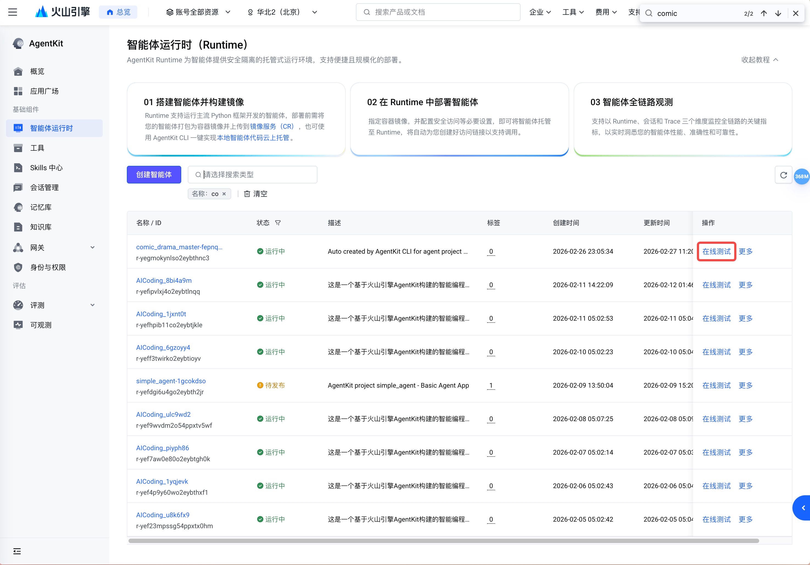
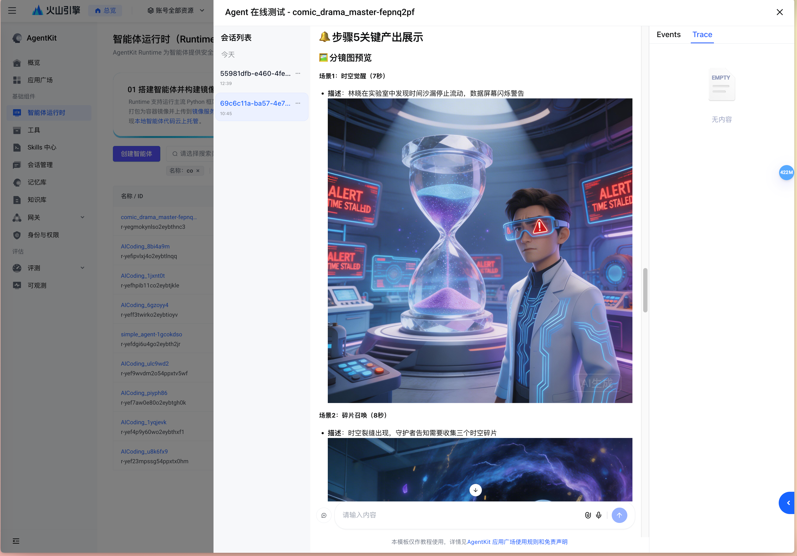

# Comic Drama Generator

English | [中文](README.md)

An AI-powered comic drama production Agent built on Volcano Engine AgentKit. Simply input a story idea, and the agent will automatically complete the entire pipeline — from screenplay writing, character design, storyboard generation, scene video generation, to final video compositing — delivering a complete comic drama video with a TOS download link.

<p align="center">
  
</p>

## Core Features

- **End-to-End Automation**: 8-step pipeline from creative concept to finished film, no manual intervention required
- **Intelligent Duration Allocation**: Dynamic 4~15 second allocation per scene for natural pacing
- **Professional Camera Language**: Built-in director-level camera strategies (speed ramps, 360° orbits, tracking shots, etc.)
- **Content Safety Pre-screening**: Automatic risk assessment with proactive handling of sensitive content
- **Style Consistency**: STYLE_ANCHOR maintained throughout the entire workflow with strict character prompt reuse
- **Output Verification**: Automatic file integrity checks + AI quality scoring after each step
- **Multi-Genre Support**: Mythology, martial arts, cultivation, urban, sci-fi, children's stories, and 10+ more genres
- **MCP Tool Integration**: Video editing capability via `@pickstar-2002/video-clip-mcp`
- **Checkpoint Resume**: Interrupted tasks can be resumed from the last completed step
- **Parallel Image Generation**: Character portraits and storyboard images support parallel generation for significantly improved efficiency
- **Auto-Retry on Failure**: Automatic retry on scene generation failures for higher success rates

## Production Pipeline

```
User Story Idea
  ↓
Step 1: Load Config → Smart duration mode (4s~15s dynamic range)
Step 2: Initialize Task Directory → Create isolated directory under COMIC_DRAMA_OUTPUT_DIR
  ↓ ⚠️ Content Safety Pre-screening
Step 3: Screenplay Generation → web-search research + script writing + duration allocation
Step 4: Character Design → image-generate portraits (parallel)
Step 5: Scene Art → image-generate storyboards (parallel)
Step 6: Scene Videos → batch_video.py submit/poll (individual duration)
Step 7: Video Compositing → ffmpeg merge + TOS upload
Step 8: Output Verification & Quality Scoring
  ↓
Complete Comic Drama Video + TOS Signed URL + Scoring Report
```

<p align="center">
  
</p>

## System Architecture

```text
User Request
    ↓
AgentKit Runtime
    ↓
Comic Drama Master (comic_drama_master)
    ├── Skill: comic-drama-master  → 8-step full pipeline orchestration
    ├── Image Generation (image_generate / batch_image_generate)
    ├── Video Generation (create_video_task / batch_video)
    ├── File Download (file_download)
    ├── Video Merging (video_merge + MCP video-clip)
    ├── TOS Upload (tos_upload)
    ├── Web Search (web_search)
    ├── Task Management (task_manager)
    ├── Output Verification (verify_task)
    └── AI Quality Scoring (video_scorer)
```

## Quick Start

### Prerequisites

#### Volcano Engine Access Credentials

1. Log in to the [Volcano Engine Console](https://console.volcengine.com)
2. Go to "Access Control" → "Users" → Create a new user → Enter "Keys" → Create a new key to obtain AK/SK
3. Go to the [Volcano Ark Console](https://console.volcengine.com/ark) → "API Key Management" → Create an API Key
4. Activate the following pre-built inference endpoints:
   - Agent model: `deepseek-v3-2-251201`
   - Image generation model: `doubao-seedream-5-0-260128`
   - Video generation model: `doubao-seedance-1-5-pro-251215`

#### Node.js Environment

- Install Node.js 18+ and npm ([Node.js Installation](https://nodejs.org/en))
- Ensure the `npx` command is available in the terminal
- The MCP video tool (`@pickstar-2002/video-clip-mcp`) will be automatically started via `npx` when the agent is running — no manual installation required

#### TOS Storage Bucket

Create a TOS storage bucket for storing generated video files. See the [TOS Bucket Creation Guide](https://www.volcengine.com/docs/6349/75024).

### Install Dependencies

```bash
cd 02-use-cases/comic_drama_gen

# Install dependencies using uv
uv sync --index-url https://pypi.tuna.tsinghua.edu.cn/simple

# Activate the virtual environment
source .venv/bin/activate
```

### Configure Environment Variables

Two methods are supported:

#### Method 1: `.env` File (Recommended)

Create a `.env` file in the `comic_drama_gen/` directory:

```bash
VOLCENGINE_ACCESS_KEY=your_ak
VOLCENGINE_SECRET_KEY=your_sk
ARK_API_KEY=your_ark_api_key
DATABASE_TOS_BUCKET=your_tos_bucket_name

# Optional
COMIC_DRAMA_OUTPUT_DIR=./my-comic-drama
VIDEO_DURATION_MINUTES=0.5
DEFAULT_VIDEO_MODEL_NAME=doubao-seedance-1-5-pro-251215
```

> The `.env` file is automatically loaded at startup (via `python-dotenv` or the built-in parser) and will not override existing exported environment variables.

#### Method 2: Direct Export

```bash
# Required
export VOLCENGINE_ACCESS_KEY=your_ak
export VOLCENGINE_SECRET_KEY=your_sk
export ARK_API_KEY=your_ark_api_key

# TOS bucket (for uploading generated videos)
export DATABASE_TOS_BUCKET=your_tos_bucket_name

# Optional
export COMIC_DRAMA_OUTPUT_DIR=./my-comic-drama
export VIDEO_DURATION_MINUTES=0.5
export DEFAULT_VIDEO_MODEL_NAME=doubao-seedance-1-5-pro-251215
```

**Environment Variables Reference:**

| Variable | Required | Default | Description |
|----------|----------|---------|-------------|
| `VOLCENGINE_ACCESS_KEY` | ✅ | — | Volcano Engine access key |
| `VOLCENGINE_SECRET_KEY` | ✅ | — | Volcano Engine secret key |
| `ARK_API_KEY` | ✅ | — | Volcano Ark API Key |
| `DATABASE_TOS_BUCKET` | ✅ | — | TOS bucket name |
| `COMIC_DRAMA_OUTPUT_DIR` | ❌ | `output/` under project dir | Output root directory |
| `VIDEO_DURATION_MINUTES` | ❌ | `0.5` | Video duration in minutes, supports 0.5/1/2/3/4 (0.5 = 30s) |
| `DEFAULT_VIDEO_MODEL_NAME` | ❌ | `doubao-seedance-1-5-pro-251215` | Video generation model name |

### Local Execution

#### Method 1: Use veadk web (Recommended for Debugging)

```bash
# Run from the 02-use-cases/ directory
cd 02-use-cases
veadk web --port 8082
```

Open `http://localhost:8082` in your browser, select the `comic_drama_master` agent, enter your story idea, and send.

#### Method 2: Direct API Call

```bash
# Enter the project directory and run directly
cd 02-use-cases/comic_drama_gen
uv run agent.py
# Service listens on 0.0.0.0:8000 by default
```

**Create a session:**
```bash
curl -X POST 'http://localhost:8000/apps/comic_drama_master/users/u_123/sessions/s_1' \
  -H 'Content-Type: application/json'
```

**Send a message:**
```bash
curl 'http://localhost:8000/run_sse' \
  -H 'Content-Type: application/json' \
  -d '{
    "appName": "comic_drama_master",
    "userId": "u_123",
    "sessionId": "s_1",
    "newMessage": {
      "role": "user",
      "parts": [{"text": "Sun Wukong battles Erlang Shen, Chinese anime 3D realistic style"}]
    },
    "streaming": true
  }'
```

### Example Prompts

| Genre | Example Prompt |
|-------|---------------|
| Chinese Mythology | `Sun Wukong battles Erlang Shen, Chinese anime 3D realistic style` |
| Martial Arts | `Legend of the Condor Heroes, Guo Jing vs Ouyang Feng, live-action version` |
| Cultivation | `Han Li forming his Nascent Soul in A Record of a Mortal's Journey to Immortality, 2 min video` |
| Historical | `Jing Ke's last night before assassinating the King of Qin` |
| Urban | `Office Showdown: Intern's rise to tech CEO, Japanese anime 2D style` |
| Sci-Fi | `Interstellar agents saving Earth` |
| Children's | `Little fox searching for star fragments` |

## Directory Structure

```
comic_drama_gen/
├── agent.py                # Agent entry (MCP tool registration, skill loading, session storage)
├── agent.yaml              # Agent configuration (model, system instructions)
├── agentkit.yaml           # AgentKit cloud deployment configuration
├── consts.py               # Default constants + .env auto-loading
├── config.py               # Common configuration constants (BASE_URL, paths, env vars)
├── .env                    # Environment variable config file (create manually)
├── Dockerfile              # Docker deployment file (auto-generated by AgentKit)
├── pyproject.toml          # Python project configuration
├── requirements.txt        # Dependency list
├── run_tests.py            # 16-scenario automated testing (sequential, supports resume)
├── run_retry.py            # Failed scenario retry script
├── run_group.py            # Grouped batch generation (reads comic_prompts_30.json)
├── batch_generate.py       # Full batch generator (30 dramas, 3 groups, per-group reports)
├── runner_utils.py         # Test utility functions (SSE sending, resume detection, service restart)
├── comic_prompts_30.json   # 30 multi-genre preset prompts (groups 1/2/3)
├── scripts/                # Helper scripts directory
│   └── setup.sh            # Cloud deployment build script (pre-installs video-clip-mcp)
├── img/                    # Image assets for README
│   ├── archtecture_video_gen.jpg
│   └── process_video_gen.jpg
├── resource/               # Static resources
└── skill/comic-drama-master/
    ├── SKILL.md             # Master director skill spec (8-step full pipeline)
    ├── examples/
    │   └── examples.md      # Complete usage examples
    ├── references/
    │   ├── character-designer.md     # Character design specification
    │   ├── scene-designer.md         # Scene art specification
    │   ├── screenplay-generator.md   # Screenplay generation specification
    │   ├── storyboard-director.md    # Storyboard direction specification
    │   └── video-synthesizer.md      # Video synthesis specification
    └── scripts/
        ├── app_config.py         # Video duration config reader
        ├── task_manager.py       # Task directory management (FIFO cleanup, max 16 tasks)
        ├── batch_video.py        # Batch video task submit/poll
        ├── batch_image_generate.py  # Batch parallel image generation
        ├── create_video_task.py  # Single video task creation
        ├── query_video_task.py   # Video task status query
        ├── image_generate.py     # Image generation (base64 direct save)
        ├── web_search.py         # Web search (for screenplay research)
        ├── video_merge.py        # ffmpeg video merging
        ├── video_scorer.py       # AI quality scoring (5 dimensions)
        ├── verify_task.py        # Output integrity verification
        ├── tos_upload.py         # TOS upload
        ├── file_download.py      # Batch file download
        └── get_aksk.py           # AK/SK credential retrieval
```

## Output Directory Structure

After each task completes, the `COMIC_DRAMA_OUTPUT_DIR` (defaults to `output/` under the project directory) will contain:

```
{COMIC_DRAMA_OUTPUT_DIR}/
└── task_20260222_143000_sun_wukong_battle/
    ├── requirements.md   # Requirements document (with web_search research summary)
    ├── plot.md           # Chapter-based plot outline (with smart duration allocation)
    ├── script.md         # Complete dialogue script (with per-second timestamps + per-chapter duration)
    ├── characters.md     # Character design (STYLE_ANCHOR + English prompts + portrait images)
    ├── cover.jpg         # Cover image
    ├── cover.md          # Cover information
    ├── final_video.md    # Final delivery document (with TOS link)
    ├── storyboard/       # Storyboards (scene_01.jpg ~ scene_NN.jpg)
    ├── characters/       # Character portraits (char_*.jpg)
    ├── videos/           # Scene videos (scene_01.mp4 ~ scene_NN.mp4, smart duration 4~15s)
    └── final/            # Composited drama (*_final.mp4)
```

## Testing

The project includes various automated testing and batch generation scripts:

```bash
# Run 16 multi-genre scenario tests sequentially (cyberpunk, ink fantasy, romance, sci-fi, etc.)
uv run python run_tests.py [start_index]

# Retry failed scenarios (resume from specified index)
uv run python run_retry.py [start_index]

# Grouped batch generation (reads comic_prompts_30.json, specify group 1/2/3)
uv run python run_group.py <group_id>

# Full batch generation of 30 comic dramas (3 groups, auto-reports per group)
uv run python batch_generate.py              # Run all 3 groups
uv run python batch_generate.py --group 2   # Run group 2 only
```

All scripts automatically start/restart the service, create sessions, send generation requests, and auto-send continuation messages when SSE connections are interrupted, until the final video is generated. `batch_generate.py` additionally supports generating Markdown progress reports per group (`report_group_N.md`).

## AgentKit Deployment

### Deploy to Volcano Engine AgentKit Runtime

```bash
cd 02-use-cases/comic_drama_gen

agentkit config \
  --agent_name comic_drama_master \
  --entry_point 'agent.py' \
  --runtime_envs DATABASE_TOS_BUCKET=your_bucket_name \
  --launch_type cloud

agentkit launch
```

### Docker Deployment

The project includes an auto-generated `Dockerfile`. You can also build manually:

```bash
cd 02-use-cases/comic_drama_gen
docker build -t comic-drama-gen .
docker run -p 8000:8000 \
  -e VOLCENGINE_ACCESS_KEY=your_ak \
  -e VOLCENGINE_SECRET_KEY=your_sk \
  -e ARK_API_KEY=your_api_key \
  -e DATABASE_TOS_BUCKET=your_bucket \
  comic-drama-gen
```

### Test the Deployed Agent

1. Visit the [Volcano Engine AgentKit Console](https://console.volcengine.com/agentkit)
2. Click **Runtime** to view the deployed agent `comic_drama_master`
3. Obtain the public access domain and API Key to call via API

#### Page-Based Debugging

The AgentKit agent list page provides a debugging entry point. Click it to debug the agent's features through a visual UI.





#### Command-Line Debugging

Use `agentkit invoke` to initiate debugging directly:

```bash
agentkit invoke '{"prompt": "Sun Wukong battles Erlang Shen, Chinese anime 3D realistic style"}'
```

#### API-Based Debugging

**Create a session:**

```bash
curl --location --request POST 'https://xxxxx.apigateway-cn-beijing.volceapi.com/apps/comic_drama_master/users/u_123/sessions/s_124' \
--header 'Content-Type: application/json' \
--header 'Authorization: <your_api_key>' \
--data ''
```

**Send a message:**

```bash
curl --location 'https://xxxxx.apigateway-cn-beijing.volceapi.com/run_sse' \
--header 'Authorization: <your_api_key>' \
--header 'Content-Type: application/json' \
--data '{
    "appName": "comic_drama_master",
    "userId": "u_123",
    "sessionId": "s_124",
    "newMessage": {
        "role": "user",
        "parts": [{
            "text": "Sun Wukong battles Erlang Shen, Chinese anime 3D realistic style"
        }]
    },
    "streaming": true
}'
```

## FAQ

**Video generation task failed (`OutputVideoSensitiveContentDetected`):**
- When the subject contains martial arts/war/violence elements, the Agent will automatically use euphemistic alternatives
- If it repeatedly fails, explicitly request "use gentle expressions" in your prompt

**`uv sync` failed:**
- Ensure Python 3.12+ is installed
- Try using a mirror: `uv sync --index-url https://pypi.tuna.tsinghua.edu.cn/simple --refresh`

**TOS upload failed:**
- Confirm that `VOLCENGINE_ACCESS_KEY`, `VOLCENGINE_SECRET_KEY`, and `DATABASE_TOS_BUCKET` are all correctly set
- Verify that the account has TOS bucket read/write permissions

**Too many task directories:**
- `task_manager.py` automatically retains the latest 16 tasks (FIFO cleanup policy)
- Use the `COMIC_DRAMA_OUTPUT_DIR` environment variable to separate test and production outputs

**`.env` file not taking effect:**
- Confirm the `.env` file is located in the `comic_drama_gen/` directory
- `.env` will not override variables already set via `export`
- Install `python-dotenv` for better compatibility, otherwise the built-in parser is used

**`npx` command not found:**
- Install Node.js 18+ and npm
- Verify that `npx --version` runs correctly in the terminal

**MCP tool connection error:**
- Ensure the default MCP port does not conflict
- Check the Node.js process logs for detailed error messages

## 🔗 Related Resources

- [AgentKit Official Documentation](https://www.volcengine.com/docs/86681/1844878)
- [Volcano Ark Console](https://console.volcengine.com/ark)
- [TOS Object Storage](https://www.volcengine.com/product/TOS)
- [AgentKit Console](https://console.volcengine.com/agentkit)

## Code License

This project is licensed under the Apache 2.0 License
